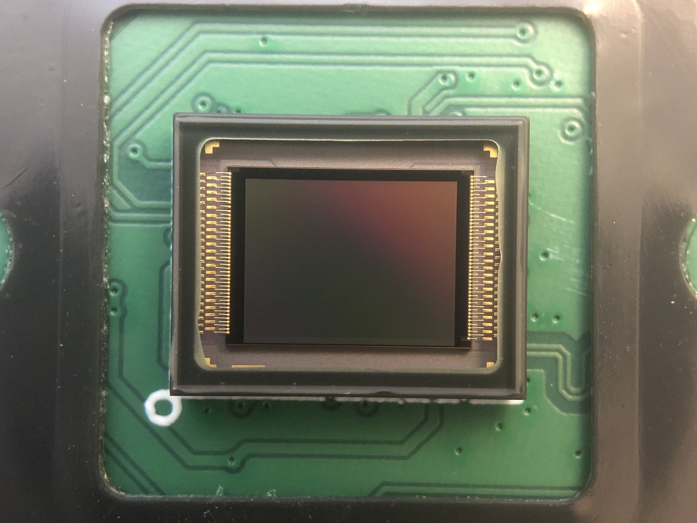
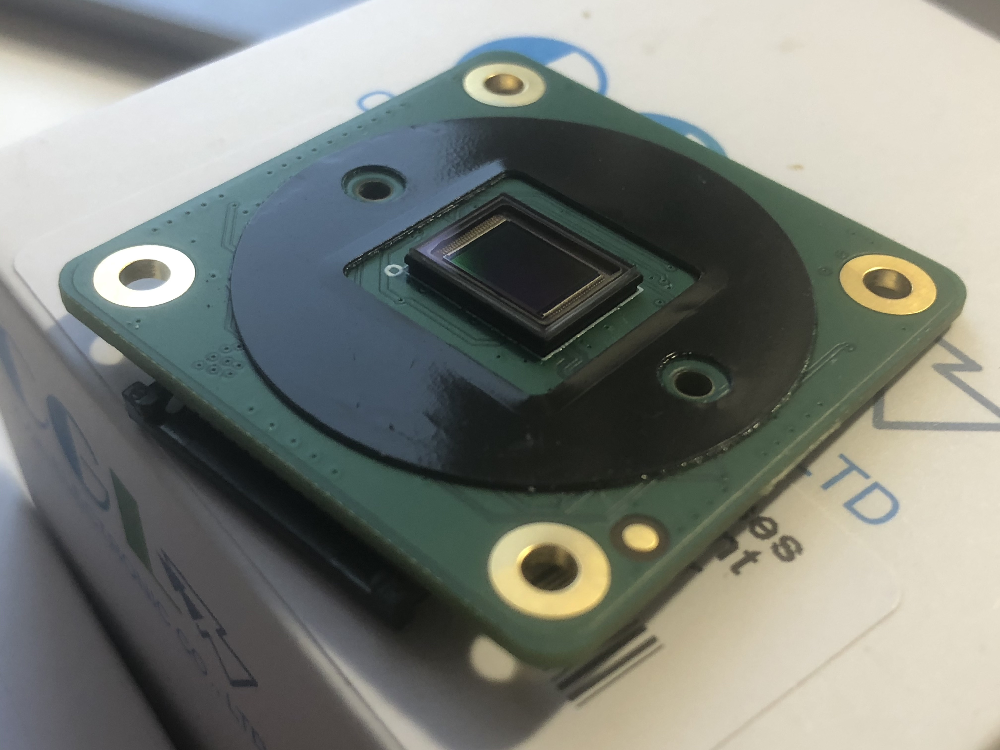
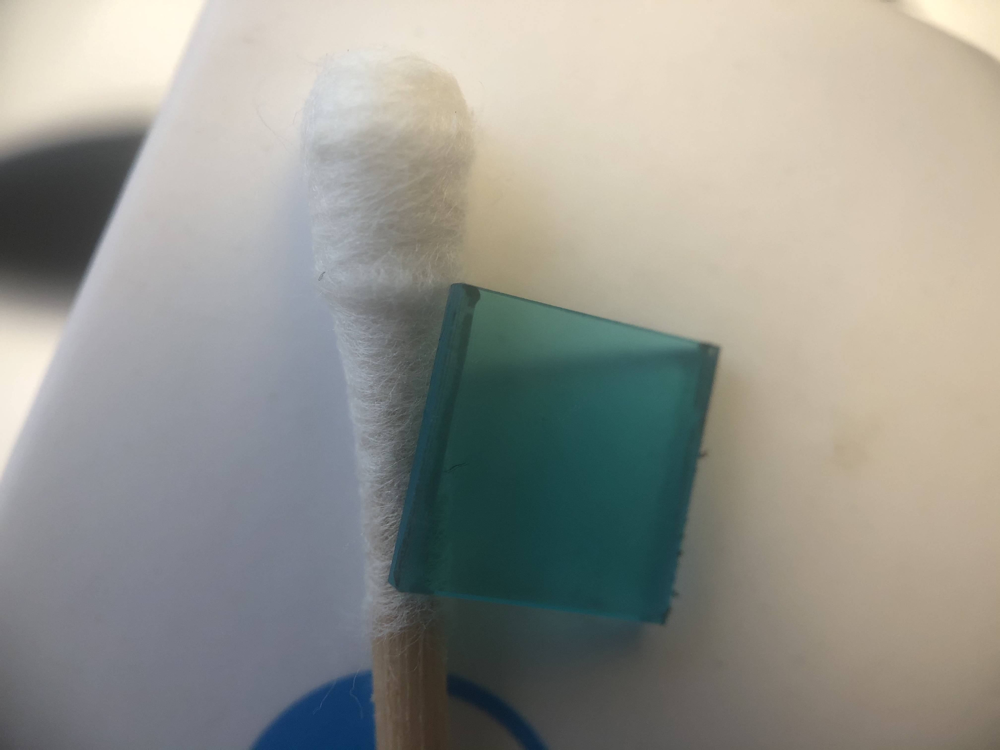
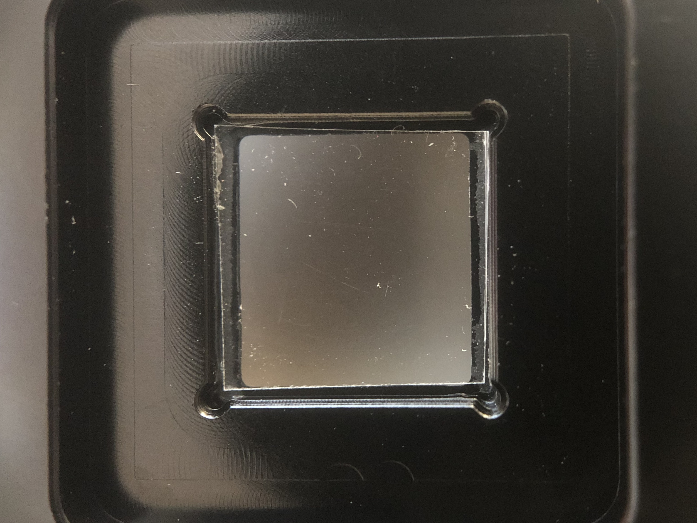

## Removing the infrared (IR) filter from the Raspberry Pi High Quality Camera

The High Quality Camera contains an IR filter, which is used to reduce the camera’s sensitivity to infrared light. This ensures that outdoor photos look more natural. However, some nature photography can be enhanced with the removal of this filter; the colours of sky, plants, and water can be affected by its removal. The camera can also be used without the filter for night vision in a location that is illuminated with infrared light.

**This procedure cannot be reversed:** the adhesive that attaches the filter will not survive being lifted and replaced, and while the IR filter is about 1.1mm thick, it may crack when it is removed. Removing it will void the warranty on the product. Nevertheless, removing the filter will be desirable to some users.

To remove the filter:
1. Work in a clean and dust-free environment, as the sensor will be exposed to the air.

1. Unscrew the two 1.5 mm hex lock keys on the underside of the main circuit board. Be careful not to let the washers roll away. There is a gasket of slightly sticky material between the housing and PCB which will require some force to separate.

1. Lift up the board and place it down on a very clean surface. Make sure the sensor does not touch the surface.
1. Before completing the next step, read through all of the steps and decide whether you are willing to void your warranty. **Do not proceed** unless you are sure that you are willing to void your warranty.
1. Turn the lens around so that it is "looking" upwards and place it on a table. 
You may try some ways to weaken the adhesive, such as a little isopropyl alcohol and/or heat (~20-30 C). Using a pen top or similar soft plastic item, push down on the filter only at the very edges where the glass attaches to the aluminium - to minimise the risk of breaking the filter. The glue will break and the filter will detach from the lens mount.

1. Given that changing lenses will expose the sensor, at this point you could affix a clear filter (OHP plastic) to minimize the chance of dust entering the sensor cavity.

1. Replace the main housing over the circuit board. Be sure to realign the housing with the gasket, which remains on the circuit board.
1. The nylon washer prevents damage to the circuit board; apply this washer first. Next, fit the steel washer, which prevents damage to the nylon washer.
1. Screw down the two hex lock keys. As long as the washers have been fitted in the correct order, they do not need to be screwed very tightly.
1. Note that it is likely to be difficult or impossible to glue the filter back in place and return the device to functioning as a normal optical camera.
